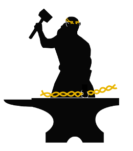

# CELEBRIMBOR 

Core ELEment Bias Removal In Metagenome Binned ORthologs

A pipeline written in Snakemake to automatically generate pangenomes from metagenome assembled genomes (MAGs).

## Dependencies:

* Snakemake
* MMseqs2
* Bakta
* Biopython
* CheckM
* Pandas
* Rust toolchain
* Panaroo

**NOTE:** Conda is used to call different environments and dependencies (see Snakemake file).

## To install:

Install the required packages using [conda](https://conda.io/projects/conda/en/latest/user-guide/install/index.html)/[mamba](https://github.com/mamba-org/mamba):

```
git clone git@github.com:bacpop/CELEBRIMBOR.git
cd CELEBRIMBOR
mamba env create -f environment.yml
mamba activate celebrimbor
```

Download the required bakta database file:

```
bakta_db download --output /path/to/database
```

You can also use the light bakta database if using a suitable version of bakta:

```
bakta_db download --output /path/to/database --type light
```

Install [cgt](https://github.com/bacpop/cgt) (will install `cgt_bacpop` executable in `./bin` directory)
```
cargo install cgt_bacpop --root .
```

Or to build from source:
```
git clone https://github.com/bacpop/cgt.git
cd cgt
cargo install --path "."
```

### Running with CheckM2

CELEBRIMBOR uses the original [CheckM1](https://genome.cshlp.org/content/25/7/1043). If you want to run with [CheckM2](https://www.nature.com/articles/s41592-023-01940-w), please also install the CheckM2 dependencies in a separate environment:

```
mamba env create -f environment_checkm2.yml
```

Also, download the required checkm2 database file:

```
mamba activate checkm2
checkm2 database download --path /path/to/database
mamba deactivate
```

### Running inside a container

An alternative, if you are having trouble with the above, is to use the CELEBRIMBOR docker
container. If you are comfortable running commands inside docker containers and mounting
your external files, the whole pipeline is in the container available by running:

```
docker pull samhorsfield96/celebrimbor:main
```

To run within the container, use the below command, replacing `path to output dir` and `path to fasta dir` with absolute paths and changing other parameters as required:

```
docker run -v <path to output dir>:/output -v <path to fasta dir>:/data samhorsfield96/celebrimbor:main snakemake --cores 4 --config genome_fasta=/data output_dir=/output bakta_db=bakta_db/db-light checkm2_db=checkm2_db/CheckM2_database/uniref100.KO.1.dmnd cgt_exe=cgt_bacpop cgt_breaks=0.05,0.95 cgt_error=0.05 clustering_method=panaroo panaroo_stringency=moderate checkm_method=checkm2
```

Note: ensure that `clustering_method`, `panaroo_stringency` and `checkm_method` parameters are not in quotes.

## Quick start:

Update `config.yaml` to specify workflow and directory paths.
- `core`: gene frequency cutoff for core gene, anything above this frequency is annotated as a core gene.
- `output_dir`: path to output directory. Does not need to exist prior to running.
- `genome_fasta`: path to directory containing fasta files (must have `.fasta` extension).
- `bakta_db`: path to bakta db downloaded above.
- `cgt_exe`: path to cgt executable.
- `cgt_breaks`: frequency for rare/core gene cutoff, e.g. `0.1,0.9`, meaning genes predicted at `<0.1` frequency will be `rare`, `0.1<=x<0.9` will be `middle` and `>=0.9` will be `core`.
- `cgt_error`: sets false assignment rate of gene to particular frequency compartment.
- `clustering_method`: choice of either `mmseqs2` (for speed) or `panaroo` (for accuracy).
- `panaroo_stringency`: Stringency of Panaroo quality control measures. One of `strict`, `moderate` or `sensitive`.

Run snakemake (must be in same directory as `Snakemake` file):

```
snakemake --cores <cores>
```

To test running of the workflow, download this repository, replace `path/to` with actual paths, and run:

```
snakemake --cores 1 --config genome_fasta=test/fasta output_dir=test_output bakta_db=path/to/bakta_db/db-light cgt_exe=path/to/cgt_bacpop cgt_breaks=0.05,0.95 cgt_error=0.05 clustering_method=panaroo panaroo_stringency=moderate checkm_method=checkm2 checkm2_db=path/to/CheckM2_database/uniref100.KO.1.dmnd 
```

This test directory contains simulated MAGs from [Kallonen et al.](https://www.ncbi.nlm.nih.gov/pmc/articles/PMC5538559/).

The output directory `test_output` will contain:

- `annotated` directory, containing gene annotations from [bakta](https://github.com/oschwengers/bakta).
- `mmseqs2` or `panaroo` directory, containing gene clusters from [mmseqs2](https://github.com/soedinglab/MMseqs2) or [Panaroo](https://github.com/gtonkinhill/panaroo) respectively.
- `presence_absence_matrix.txt`, a tab-separated file describing the presence/absence of genes (rows) in each genome (columns).
- `pangenome_summary.tsv`, a tab-separated file detailing gene annotations, frequencies and pre-adjustment frequency compartments in the pangenome.
- `checkm_out.tsv`, a summary file generated by [CheckM1](https://github.com/Ecogenomics/CheckM) or [CheckM2](https://www.nature.com/articles/s41592-023-01940-w) describing genome completeness and contamination.
- `cgt_output.txt`, a summary file detailing the observed frequency and adjusted frequency compartment of each gene in the pangenome.

## Overview of workflow

This workflow annotates genes in metagenome-assembled genomes (MAGs) and using a probabilistic model to assign each gene to a gene frequency compartment based on their respective frequencies and genome completeness.

1. Predict genes in all FASTA files in given directory using [bakta](https://github.com/oschwengers/bakta)
1. Cluster genes using [MMseqs2](https://github.com/soedinglab/MMseqs2) or [Panaroo](https://github.com/gtonkinhill/panaroo) and generate a gene presence/absence matrix
1. Generate a pangenome summary of observed gene frequencies
1. Calculate genome completeness using [CheckM](https://github.com/Ecogenomics/CheckM)
1. Probabistically assign each gene family as `core|middle|rare` using [cgt](https://github.com/bacpop/cgt)

## Citations

When using CELEBRIMBOR, please cite:

- [Bakta](https://www.microbiologyresearch.org/content/journal/mgen/10.1099/mgen.0.000685#tab2)
- [MMseqs2](https://www.nature.com/articles/nbt.3988)
- [Panaroo](https://genomebiology.biomedcentral.com/articles/10.1186/s13059-020-02090-4)
- [CheckM](https://genome.cshlp.org/content/25/7/1043)
- [CheckM2](https://www.nature.com/articles/s41592-023-01940-w)


